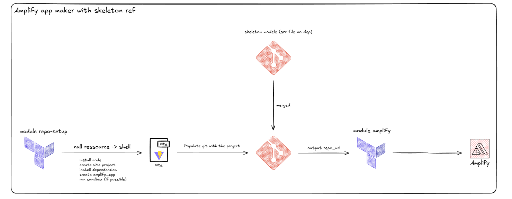

## Amplify App Maker Idea


## Multi-Projets Terraform

### Structure
- `for_each = var.projects` dans `main.tf` → déploie N projets
- Ajout projet = ajout bloc dans `terraform.tfvars`

### Ajouter un projet

**terraform.tfvars :**
```hcl
projects = {
  "projet-existant" = { ... }
  
  "nouveau-projet" = {
    app_name               = "nouveau-projet"
    skeleton_repo_url      = "https://gitlab.com/..."
    skeleton_folders       = "src"
    skeleton_files         = "package.json vite.config.ts"
    extra_dependencies     = "react react-dom"
    extra_dev_dependencies = "vite typescript"
    git_user_email         = "dev@llify.io"
    git_user_name          = "Team"
  }
}
```

Push → CI déploie auto.

### Token expiré ?

1. GitLab → Settings → Access Tokens → Create (scope `api`)
2. Projet → Settings → CI/CD → Variables → Edit `TF_VAR_gitlab_token`
3. Retry pipeline